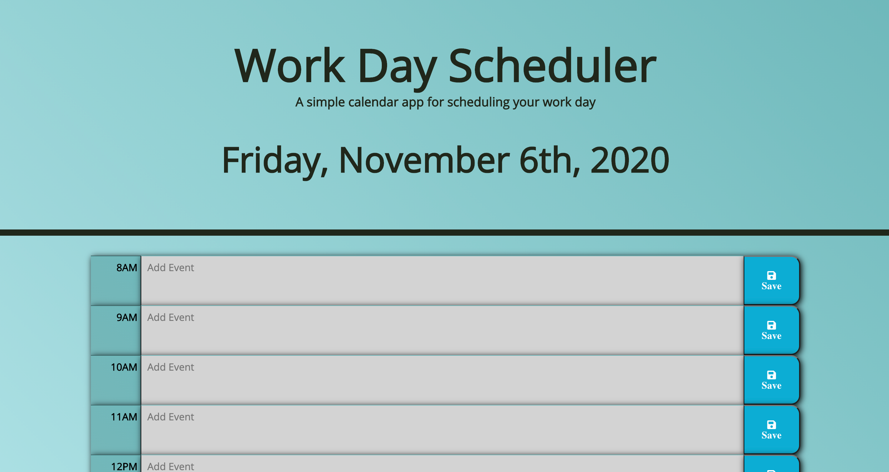

# Plan Your Day

## Description

This application is a planner to help schedule out your workday. It allows you to enter and save events based on when they are scheduled. The planner utilizes Moments.js to display if the hour is in the past, present, or future, and is color-coded accordingly.

The JavaScript and jQuery used to create this app was written by me, DJ Hersh. The HTML and CSS were provided by the UCLA Extension Full-Stack Web-Development Coding Bootcamp and instructor Bryan Swarthout. I added some styling elements, such as a linear-gradient for the background and box-shadows around the time-blocks.

I utilized local storage to allow the user to save events even after they navigate away from the page.

## Link

https://dj620.github.io/plan-your-day-efficiently/

## Usage

When you get to the page, you will see the current date displayed at the top, and a block to add scheduled events for each hour of the workday. To add an event, simply click on the box in the appropriate hour block, enter your event, and click the save button. Using Moments.js, the planner will be color-coded based on if the hour of the block has past, is current, or is in the future.

## Credits

First I must credit the UCLA Extension Full-Stack Web Development Coding Bootcamp, instructor Bryan Swarthout, and TA Wilson Lam for providing me with all of the tools and knowledge I used to build this planner.

http://www.uclaextension.edu

While I didn't write the HTML myself, I did manipulate it a bit using some Bootstrap properties.

http://getbootstrap.com

I created the favicon using favicon.io

https://favicon.io

## License

MIT License

Copyright (c) [2020] [DJ Hersh]

Permission is hereby granted, free of charge, to any person obtaining a copy
of this software and associated documentation files (the "Software"), to deal
in the Software without restriction, including without limitation the rights
to use, copy, modify, merge, publish, distribute, sublicense, and/or sell
copies of the Software, and to permit persons to whom the Software is
furnished to do so, subject to the following conditions:

The above copyright notice and this permission notice shall be included in all
copies or substantial portions of the Software.

THE SOFTWARE IS PROVIDED "AS IS", WITHOUT WARRANTY OF ANY KIND, EXPRESS OR
IMPLIED, INCLUDING BUT NOT LIMITED TO THE WARRANTIES OF MERCHANTABILITY,
FITNESS FOR A PARTICULAR PURPOSE AND NONINFRINGEMENT. IN NO EVENT SHALL THE
AUTHORS OR COPYRIGHT HOLDERS BE LIABLE FOR ANY CLAIM, DAMAGES OR OTHER
LIABILITY, WHETHER IN AN ACTION OF CONTRACT, TORT OR OTHERWISE, ARISING FROM,
OUT OF OR IN CONNECTION WITH THE SOFTWARE OR THE USE OR OTHER DEALINGS IN THE
SOFTWARE.

